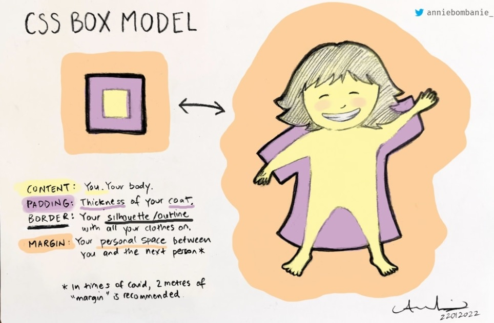

# border VS. padding. VS. margin

> content: 你的身體
>
> padding: 衣服的厚度
>
> border: 你整個人的輪廓（含衣服）
>
> margin: 你的社交距離
>

## 資料來源

* 網頁開發雜記（文字來源）
  * https://www.facebook.com/thingsaboutwebdev/photos/a.612011045594423/4490335454428610/

* CSS Box Model — an illustrated analogy.（圖片來源）
  * https://twitter.com/anniebombanie_/status/1485600904720101380