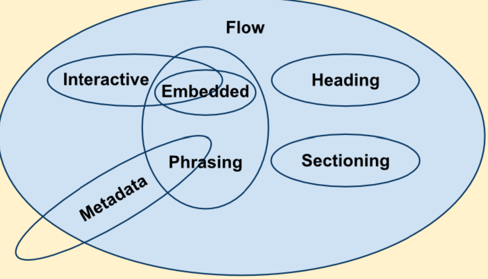

# Flow Content


## What


大部分的文件與應用都屬於這類。

> Most elements that are used in the body of documents and applications are categorized as flow content.




## Which


以下是列舉的元件：

  ```html
  <a>, <abbr>, <address>, <area> (if it is a descendant of a <map> element) <article>, <aside>, <audio>, <b>, <bdi>, <bdo>, <blockquote>, <br>, <button>, <canvas>, <cite>, <code>, <data>, <datalist>, <del>, <details>, <dfn>, <dialog>, <div>, <dl>, <em>, <embed>, <fieldset>, <figure>, <footer>, <form>, <h1>, <h2>, <h3>, <h4>, <h5>, <h6>, <header>, <hr>, <i>, <iframe>, , <input>, <ins>, <kbd>, <label>, <link> (if it is allowed in the body) <main>, <map>, <mark>, MathML <math>, <meter>, <nav>, <noscript>, <object>, <ol>, <output>, <p>, <picture>, <pre>, <progress>, <q>, <ruby>, <s>, <samp>, <script>, <section>, <select>, <small>, <span>, <strong>, <style>, <sub>, <sup>, SVG <svg>, <table>, <template>, <textarea>, <time>, <u>, <ul>, <var>, <video>, <wbr>, text
  ```


## 參考資料

* 3.2.4.2.2. Flow content
  * https://www.w3.org/TR/2021/SPSD-html52-20210128/dom.html#flow-content

* 內容類型
  * https://developer.mozilla.org/zh-TW/docs/Web/Guide/HTML/Content_categories#流內容（flow_content）